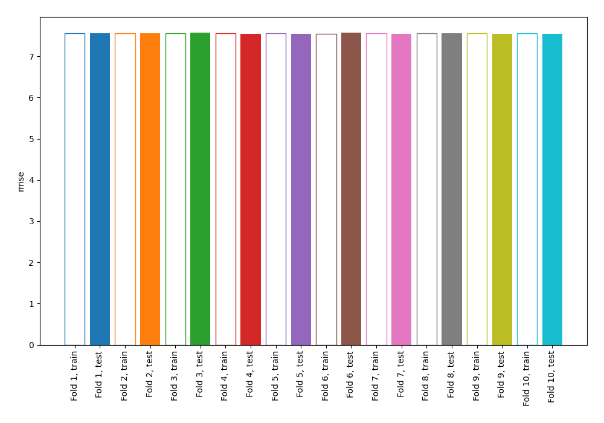
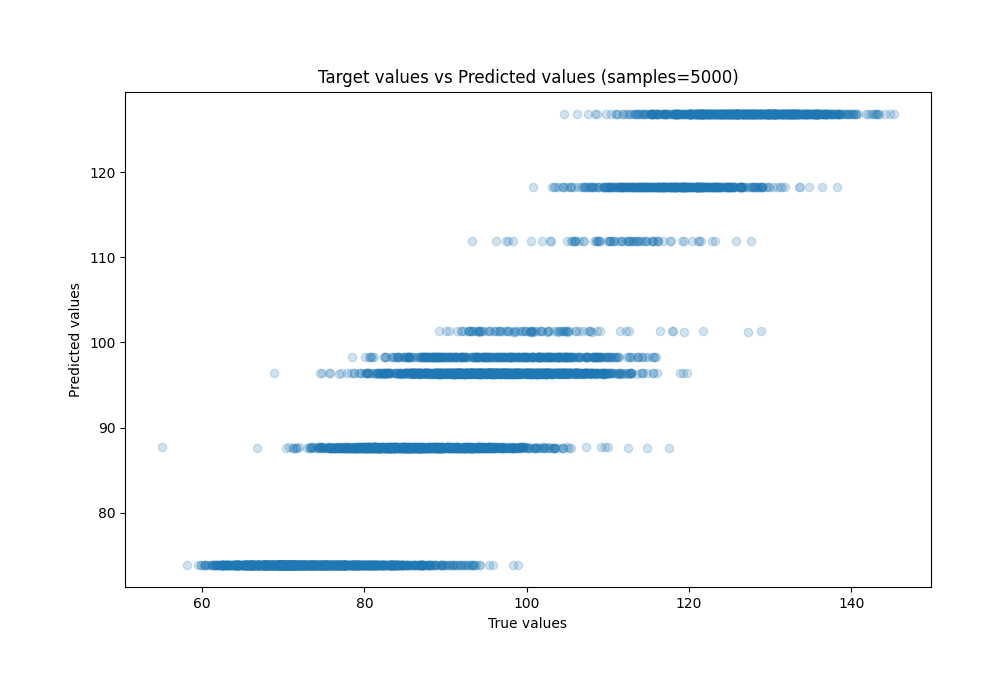
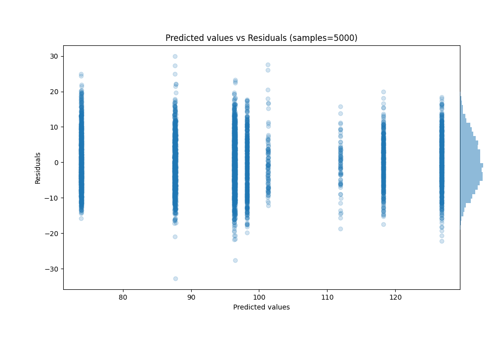

# Summary of 1_DecisionTree

[<< Go back](../README.md)

## Decision Tree
- **n_jobs**: -1
- **criterion**: squared_error
- **max_depth**: 3
- **explain_level**: 0

## Validation
 - **validation_type**: kfold
 - **shuffle**: True
 - **k_folds**: 10

## Optimized metric
rmse

## Training time

33.7 seconds

### Metric details:
| Metric   |      Score |
|:---------|-----------:|
| MAE      |  6.12036   |
| MSE      | 57.1035    |
| RMSE     |  7.55669   |
| R2       |  0.842973  |
| MAPE     |  0.0664534 |

## Learning curves

## True vs Predicted

## Predicted vs Residuals

[<< Go back](../README.md)
