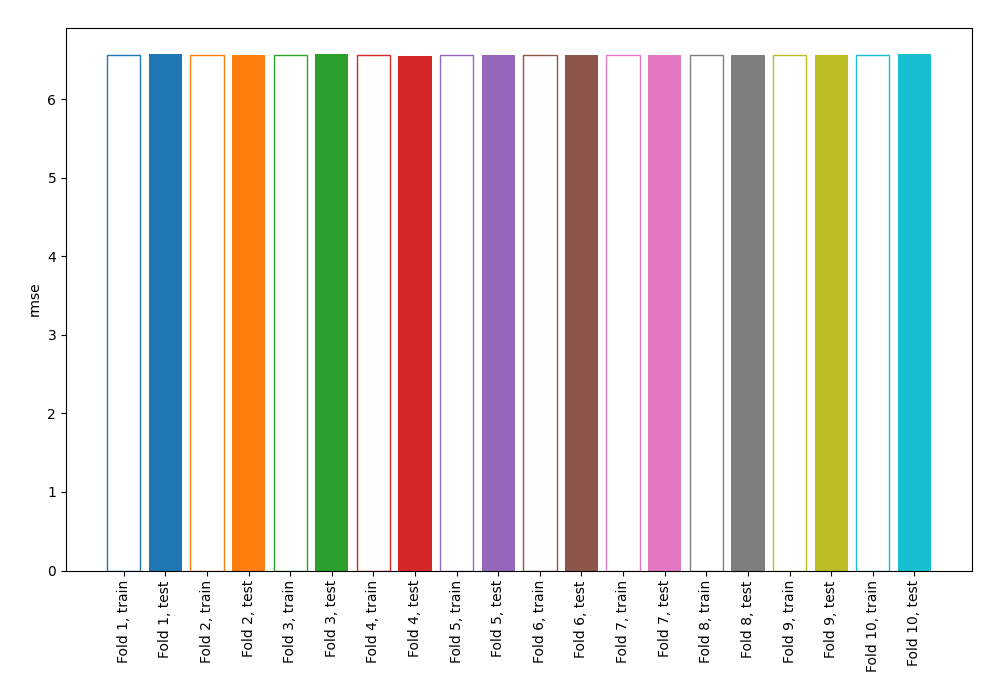
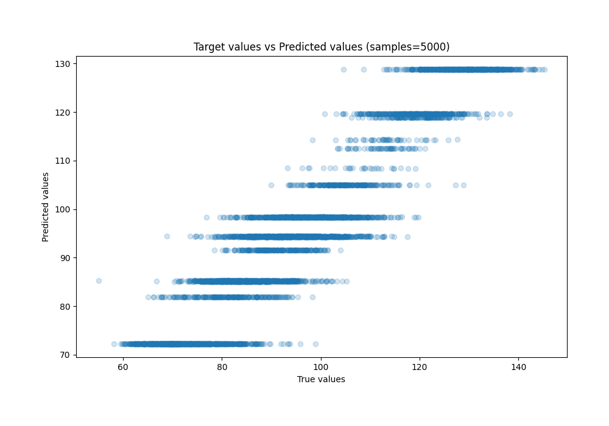
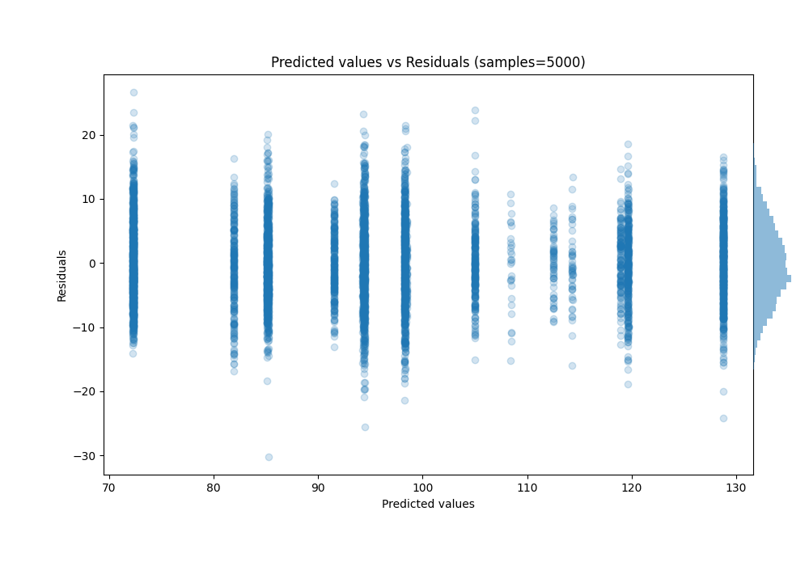

# Summary of 2_DecisionTree

[<< Go back](../README.md)

## Decision Tree
- **n_jobs**: -1
- **criterion**: squared_error
- **max_depth**: 4
- **explain_level**: 0

## Validation
 - **validation_type**: kfold
 - **shuffle**: True
 - **k_folds**: 10

## Optimized metric
rmse

## Training time

42.3 seconds

### Metric details:
| Metric   |      Score |
|:---------|-----------:|
| MAE      |  5.21742   |
| MSE      | 43.0665    |
| RMSE     |  6.56251   |
| R2       |  0.881573  |
| MAPE     |  0.0567729 |

## Learning curves

## True vs Predicted

## Predicted vs Residuals

[<< Go back](../README.md)
