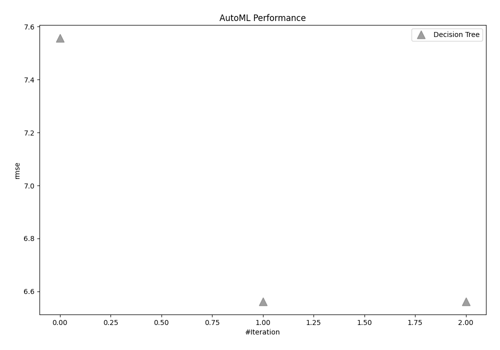
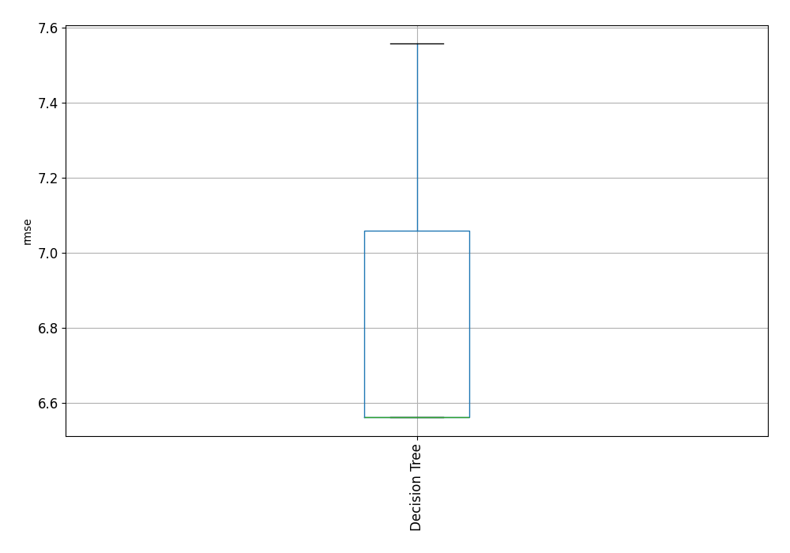

# AutoML Leaderboard

| Best model   | name                                       | model_type    | metric_type   |   metric_value |   train_time |
|:-------------|:-------------------------------------------|:--------------|:--------------|---------------:|-------------:|
|              | [1_DecisionTree](1_DecisionTree/README.md) | Decision Tree | rmse          |        7.55669 |        35.48 |
|              | [2_DecisionTree](2_DecisionTree/README.md) | Decision Tree | rmse          |        6.56251 |        44.06 |
| **the best** | [3_DecisionTree](3_DecisionTree/README.md) | Decision Tree | rmse          |        6.56251 |        41.98 |

### AutoML Performance

### AutoML Performance Boxplot
